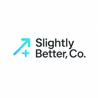

# 🌟 Slightly Better, Co.

Welcome to Slightly Better, Co.! We’re an independent, bootstrapped studio creating SaaS products that make life just a little bit better every day.

### 🚀 Our Mission
We believe small improvements add up. Our tools are crafted with care, creativity, and curiosity — designed to empower, delight, and simplify.

### 🛠️ Current Projects
- **Momentum** — SaaS project #1
- **Feedback** — SaaS project #2
- **Rehearsal** - SaaS project #3

### 💡 About Us
Founded by [Matt Hall](https://github.com/matthall00), Slightly Better, Co. is a space where code, creativity, and experimentation come together. We love building products that make people’s lives a little easier, a little more joyful, or a little more meaningful.

🌐 Visit us at [slightlybetter.dev](https://slightlybetter.dev)
